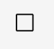
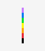

# Examples

Draw a square: `square.egg`<br> <br>


```
pen_move 50
pen_rotate rotate 90
pen_move 50
pen_rotate rotate 90
pen_move 50
pen_rotate rotate 90
pen_move 90
```
Draw a triangle: `triangle.egg`<br> <br>
 

```
pen_move 50
pen_rotate 120
pen_move 50
pen_rotate 120
pen_move 50
```
Draw a rainbow: `rainbow.egg` <br> <br>

```
pen_move 10
pen_color red
pen_move 10
pen_color orange
pen_move 10
pen_color yellow
pen_move 10
pen_color green
pen_move 10
pen_color blue
pen_move 10
pen_color purple
pen_move 10
```

