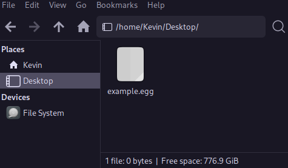
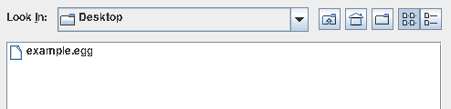
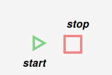

# How To Use Egg

Egg is a program to make simple drawings through code.

- Create a file ending with ".egg".
- Write your Egg code in this file. This file is called a script. (See "Learn Egg" & "Examples")
- Save it somewhere you can find it, like on your desktop.
- 
- Launch Egg.
- Load in the file by clicking the "Load New" button, and finding it through the file picker.
- 
- Hit the play button the start drawing from the script, or the stop button to stop drawing the script.
- 
